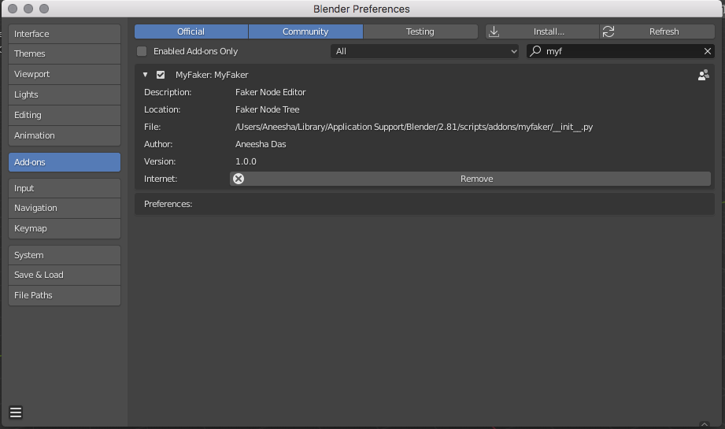

# Capstone assignment of EPAi4.0
### Submitted by Aneesha Das
### E-mail id: dasaneesha@gmail.com

## Introduction
## myfaker
_myfaker_ is an add-on for Blender, which can be used to generated data using the _Node_ _Editor_ in Blender. _myfaker_ simulates the faker library and provides provider nodes and configurations for the end user to select. _myfaker_ can be added to Blender, and the node editor can be used to configure the node settings; the output data is generated and displayed in the console. This version of _myfaker_ is compatible with Blender _version_ _3.0.0_ </br> </br>


## Usage:
### Install Faker library in Blender 
Install the _faker_ library in Blender by using the following commands in the Python console available in Blender:
```python
from pip._internal import main
main(['install', 'faker'])
```
### Add the myfaker add-on in Blender
Dowload the _myfaker.zip_ file from the "_add-on_" folder in this repository, and add the myfaker add-on using the "_Preferences_" section in Blender. You can also download the code and zip the contents to generate _myfaker.zip_</br> </br>


### Access the Faker Node Tree
Access the Faker Node Tree from Blender </br> </br>


## MyFaker Nodes:
The following Faker providers have been provided as nodes:</br>
1. address </br>
2. bank </br>
3. company </br>
4. credit card </br>
5. geo </br>
6. job </br>
7. license plate </br>
8. person </br>
9. phone </br>
10. social security number </br> </br>

The generator node consolidates inputs from all nodes to generate the fake data. User can specify the number of recordsin as an input in generator node.

## Description of the project
### Blender Python API
The Blender Python API provides a framework using nodes, sockets and links for users to create custom add-ons 

#### Nodes
In the current project, each individual nodes represent a data point, whose output is forwarded to a final supra node that conditionally displays the incoming data fields. This implies that the user can choose whether the information being output from a node can be displayed or not.
#### Sockets
The entry of data as well as its forwarding to the next node happens via points housed within panels inside each node. These panels are known as sockets.
#### Links
The connection between individual nodes and the entry points within the sockets happens via links, which are also known as edges.

### myfaker 
The Python API of Blender and its various other elements described above have been used to create a directional data flow model. The directional data flow model channels the inputs from a source node to a recipient node which has the appropriate socket point to receive the data from the former. In order to ensure that any change of input in the source node is reflected in the recipient as well, appropriate backend codes have been deployed. 

The following Faker providers have been created as custom nodes. </br>
1. address </br>
2. bank </br>
3. company </br>
4. credit card </br>
5. geo </br>
6. job </br>
7. license plate </br>
8. person </br>
9. phone </br>
10. social security number </br></br>

The inputs are captured from the user as properties in custom nodes, and outputs have been defined as custom sockets. The generator node consolidates inputs from all nodes and uses the underlying faker library to generate the fake data. User can specify the number of recordsin as an input in generator node.

## References
* Sorcar Node Editor in Blender - https://github.com/aachman98/Sorcar
* MTree Node Editor in Blender - https://github.com/MaximeHerpin/modular_tree/tree/blender_28


